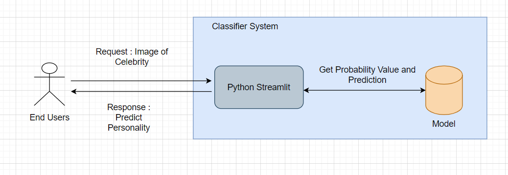
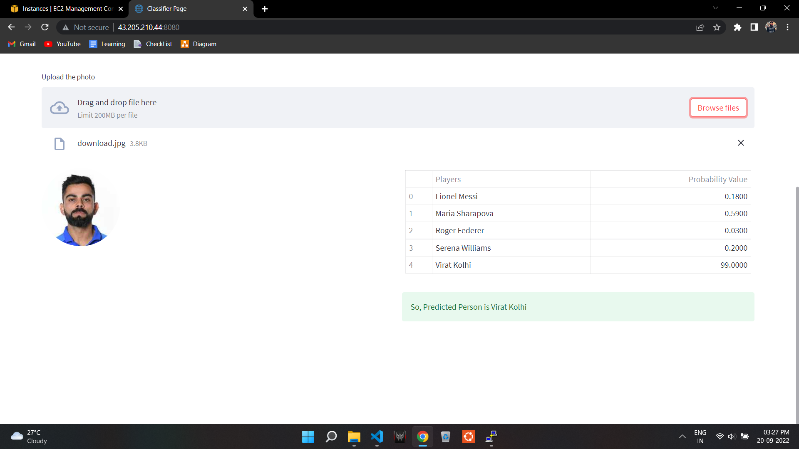

# Sports Person Classifier

  

This project's main goal is to produce Sports Person Classifier using `OpenCV` and `Support Vector Machines`.

A sizable open-source library for image processing, machine learning, and computer vision is called OpenCV. Python, C++, Java, and many other programming languages are supported by OpenCV. It can analyse pictures and movies to find faces, objects, and even human handwriting.

In essence, SVM identifies a hyper-plane that establishes a distinction between the various types of data. This hyper-plane is only a line in two-dimensional space. Each dataset item is plotted in an N-dimensional space using SVM, where N is the total number of features and attributes in the dataset. The best hyperplane should then be found to divide the data. You must have realised by now that SVM can only perform binary classification naturally (i.e., choose between two classes).
## Architechture

## Screenshot

## Project Execution

1. Install this repository locally by cloning it or downloading it.
2. Using the command `pip install -r requirements.txt`, install every library included in the requirements.txt file.
3. Run the file `main.py` by using the command `streamlit run main.py` at the terminal or command line after opening your project directory (Website Directory).
4. Cheers! The website will launch.

        Note : Specific requirement.txt is also there in order to run the notebook as well.
## Deployment

1. Website build in streamlit in hosted in AWS
2. Create EC2 instance with ubuntu server
3. Login via Putty to go the terminal
4. Install all packages
5. Run `streamlit run streamlit_app.py --server.port 8080` and done..
## Core Concept

1. Collect image data.
2. Identify Facial Values and Important features via opencv & pywavelets.
3. Convert them to numerical as each pixel represent some number representation.
4. Classify using Support Vector Machines to get predictions. 
## Links

1. Website - http://43.205.210.44:8080/ 
